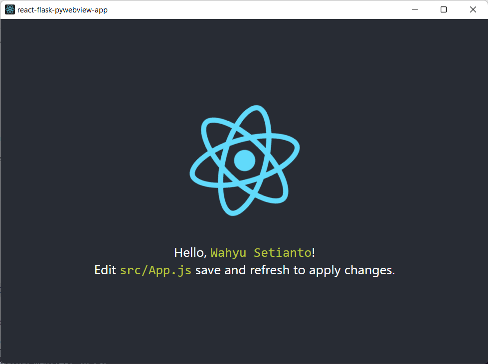

# PyWebView-React-Flask Template



`PyWebView` application using `react` for the frontend and `flask`
to handle the backend.

## Setup

Clone this repo and run this commands on your terminal

```bash
yarn run init
```

that will install all dependencies to run the app.

## Start the Application

On your terminal run this command

```bash
yarn start
```

**Note**

This template don't support hot reload to apply changes on your `frontend` code you need to _right click_ and _refresh_

## Build the Application

Build the application using this command

```bash
yarn build
```
